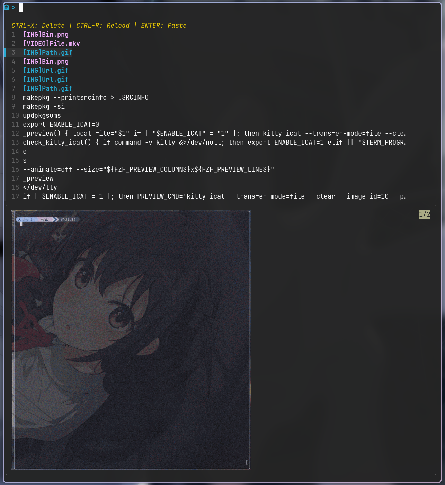
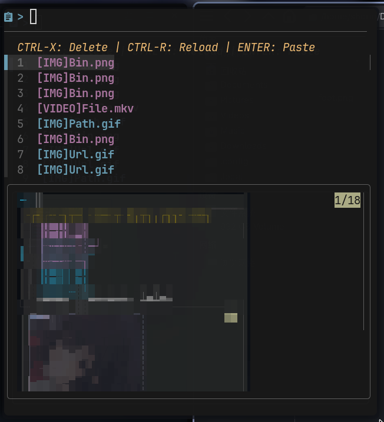

# Cliphist-tui

Old name: shorinclip

A wayland clipboard TUI with rich media(IMG/GIF/Video etc.) preview based on `fzf` `wl-clipboard` `cliphist`.

Use `chafa` for image preview, `kitty icat` for gif preview when using native kitty, `ffmpegthumbnailer` for video thumb generation.

## Showcase

- Ctrl+X delete selection


- Auto refresh when clipboard changed and Alt+X delete all


- Ctrl+E/O open videos or pictures from clipboad manager


## Installation

```
yay -S cliphist-tui-git
```

For best image preview, a terminal which supports kitty image protocol is needed, such as `kitty` or `ghostty`, or you can let chafa handle image preview (maybe low quality).

For example :

- foot

    

- alacritty

    

## Usage

Open cliphist daemon with this command:

```
wl-paste --watch cliphist store
```

Open tui with this command: `cliphist-tui` or `shorinclip`.

Then it just works.

Don't forget to setup autostart in your wayland compositor's config file.

- Niri

    ```
    spawn-at-startup "wl-paste" "--watch" "cliphist" "store"
    ```

- Hyprland

    ```
    exec-once = wl-paste --watch cliphist store
    ```
